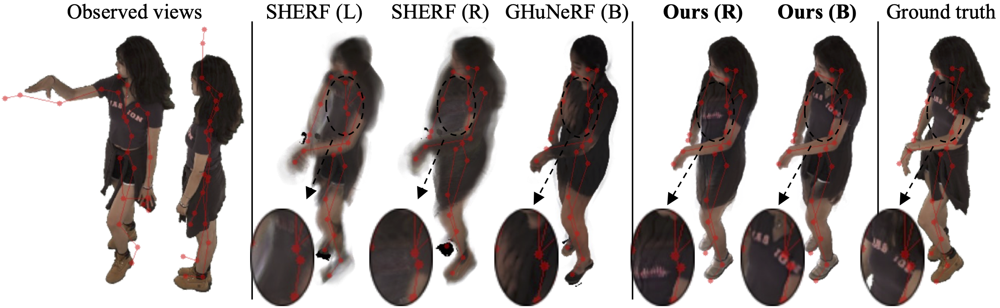

# _HumMorph_: Generalized Dynamic Human Neural Fields from Few Views (CVPRW 2025)

[Jakub Zadrozny](https://jakubzadrozny.github.io/), 
[Hakan Bilen](https://homepages.inf.ed.ac.uk/hbilen/) | 
University of Edinburgh | **[ 🖥️ Project Page](https://jakubzadrozny.github.io/hummorph/)** | 
**[📝 Paper](https://arxiv.org/abs/2504.19390)**



This is the official implementation of **_[HumMorph](https://jakubzadrozny.github.io/hummorph/)_** using [PyTorch](https://pytorch.org/).

> We introduce **_HumMorph_**, a novel generalized approach to free-viewpoint rendering of dynamic human bodies
with explicit pose control. HumMorph renders a human actor in any specified pose given a few observed views (starting
from just one) in arbitrary poses. Our method enables fast inference as it relies only on feed-forward passes through the
model. We first construct a coarse representation of the actor in the canonical T-pose, which combines visual
features from individual partial observations and fills missing information using learned prior knowledge. The coarse
representation is complemented by fine-grained pixel-aligned features extracted directly from the observed views, which
provide high-resolution appearance information. We show that HumMorph is competitive with the state of the art
when only a single input view is available, however, we achieve results with significantly better visual quality given
just 2 monocular observations.
>
> Moreover, previous generalized methods assume access to accurate body shape and pose parameters
obtained using synchronized multi-camera setups. In contrast, we consider a more practical scenario where
these body parameters are noisily estimated directly from the observed views. Our experimental results demonstrate
that our architecture is more robust to errors in the noisy parameters and clearly outperforms the state of the art
in this setting.

## 🛠️ Installation

We recommend using [Anaconda](https://www.anaconda.com/) to set up a Python environment.

Create and activate a virtual environment:
```
conda env create -f environment.yaml
conda activate hummorph
```

_Note_: this repository has only been tested in Linux and `environment.yaml` will only install on Linux. You can use `env_macos.yaml` on macOS, however, parts of the repo might not work properly.

### Download the SMPL Model

Download the gender neutral SMPL model (`smplify_code_v2.zip`) from [here](https://smplify.is.tue.mpg.de/), unpack `mpips_smplify_public_v2.zip`, and copy the SMPL `.pkl` file to `third_parties/smpl/models`:
```
cp /path/to/smpl/smplify_public/code/models/basicModel_neutral_lbs_10_207_0_v1.0.0.pkl third_parties/smpl/models
```

Follow [this page](https://github.com/vchoutas/smplx/tree/master/tools) to remove Chumpy objects from the SMPL model.
_Note:_ the original script is written for Python 2, but you can use Python 3. Just swap `body_data = pickle.load(body_file)` in line 34 to 
```
body_data = pickle.load(body_file, encoding='latin1')
```
and `body_data.iteritems()` in line 37 to `body_data.items()`.

## 🧑‍🍳 Prepare Data

### HuMMan

1. Download the [HuMMan (Recon)](https://caizhongang.com/projects/HuMMan/recon.html) dataset.

2. Run the data processing script:
```
python -m tools.prepare_humman <data_root> <out_root>
```
where `data_root` is the path to the top level of the downloaded dataset, and `out_root` is a path where the _processed_ dataset will be written.

3. Modify `dataset_path` for `humman_*` in `core/data/dataset_args.py` to your `out_root`.

4. Copy the train/test splits file to your `out_root`:
```
cp splits/humman_splits.json <out_root>/splits.json
```

### DNA-Rendering

1. Download the [DNA-Rendering](https://dna-rendering.github.io/index.html) dataset following [instructions](https://dna-rendering.github.io/inner-download.html).
_Warning_: you'll need around 4T of storage to download and process the dataset.

2. Download `SMCReader.py` from the [DNA-Rendering repository](https://github.com/DNA-Rendering/DNA-Rendering/blob/main/scripts/3DGS/SMCReader.py) and place it under `tools/prepare_dna/SMCReader.py`. Modify line 371 to
```
t_frame = self.smc['SMPLx']['fullpose'][()].shape[0]
```

3. Download SMPL-X model and SMPLX-to-SMPL transfer model:
register and download 'SMPL-X v1.1' and 'Model correspondences' from [here](https://smpl-x.is.tue.mpg.de/download.php). Then execute from _HumMorph_ root directory:
```
mv /path/to/smpl-x-models/smplx third_parties/smpl/models/
rm -r /path/to/smpl-x-models
mv /path/to/smpl-x-model_transfer third_parties/smpl/models/
cd third_parties/smpl/models
mkdir smpl
cp basicModel_neutral_lbs_10_207_0_v1.0.0.pkl smpl/SMPL_NEUTRAL.pkl
```

4. Get the SMPLX-to-SMPL model transfer code from the [SMPL-X repo](https://github.com/vchoutas/smplx.git):
```
git clone https://github.com/vchoutas/smplx.git
mv smplx/transfer_model/* third_parties/smpl/transfer_model/
rm -rf smplx
```
and change line #22 in `third_parties/smpl/transfer_model/optimizers/minimize.py` to `from ..utils import (from_torch, Tensor, Array, rel_change)`.

5. Run the data processing script:
```
python -m tools.prepare_dna <data_root> <part> <out_root>
```
where `data_root` is the path to the top level of the downloaded dataset, `part` is either 1 or 2 (it is recommended to begin with the much smaller part 1) and `out_root` is a path where the _processed_ dataset will be written (use the same `out_root` for both parts).

6. Modify `dataset_path` for `dna_rendering_*` in `core/data/dataset_args.py` to your `out_root`.

7. Copy the train/test splits file to your `out_root`:
```
cp splits/dna_rendering_splits.json <out_root>/splits.json
```

#### Parallelize data processing
Data processing for DNA-Rendering requires [SMPL-X to SMPL parameter transfer](https://github.com/vchoutas/smplx/tree/main/transfer_model#smpl-x-to-smpl), which is time-consuming.
It is recommended to parallelize the script over multiple CPUs. Unfortunately parallelizing it inside Python proved difficult and prone to deadlocks, so it is recommended to do it using a bash script.
Launch your workers using the following call:
```
OMP_NUM_THREADS=N_THREADS python -m tools.prepare_dna data_root part out_root --rank RANK --world_size WORLD_SIZE
```
where `RANK` is the worker ID (from 0 to `WORLD_SIZE-1`), `WORLD_SIZE` is the total number of workers, and `N_THREADS` is the number of threads per worker. Generally `WORLD_SIZE * N_THREADS` should not exceed the number of CPU cores in your system and it is recommended to use lowe `N_THREADS` and higher `WORLD_SIZE`.

### Estimate Poses using [HybrIK](https://github.com/jeffffffli/HybrIK)
1. Clone the [HybrIK repository](https://github.com/jeffffffli/HybrIK) and follow the installation instructions. You should be fine installing HybrIK and its requirements on top of the `hummorph` conda env.

2. Download the 'HRNet-W48 (w/ 3DPW)' pretrained model (from [here](https://drive.google.com/file/d/1gp3549vIEKfbc8SDQ-YF3Idi1aoR3DkW/view?usp=share_link)) and place it in `<hybrik_root>/pretrained_models/`.

3. Run:
```
python -m tools.estimate_smpl --cfg experiments/hummorph/<dataset>/hummorph_<dataset>.yaml hybrik.root <hybrik_root> [n_gpus N_GPUS] 
```
where:
- `<hybrik_root>` is the path to HybrIK's root directory,
- `<task>` is either `humman` or `dna_rendering`,
- `N_GPUS` is optionally the number of GPUs to use.

### Your Own Data
To train/evaluate _HumMorph_ on a custom dataset, it should be organized as follows:
```
dataset_root
    ├── seq_1
    ├── seq_2
        └── cameras.pkl
        └── images
            └── frame_000000.jpg
            └── frame_000001.jpg
            └── ...
        └── masks
            └── frame_000000.png
            └── frame_000001.png
            └── ...
        └── mesh_infos.pkl
        └── canonical_joints.pkl
    ├── ...
    └── splits.json
```
where:
- `cameras.pkl` maps frame names to dicts with the corresponding camera intrinsic and extrinsic (world-to-camera) matrices, and optionally distortion parameters,
- `mesh_infos.pkl` maps frame names to dicts containing the corresponding:
    - SMPL body shape and pose parameters,
    - global body rotation and translation,
    - 3D joint positions,
- `canonical_joints.pkl` contains the 3D joint positions in the canonical T-pose.
- `splits.json` specifies the train/test subject split.

For detailed formatting examples, please see `tools/prepare_humman/prepare_dataset.py`.

## 🧠 Run Evaluation

1. (Optional) Download pretrained models:
- Trained on [HuMMan](https://caizhongang.com/projects/HuMMan):
    - for _accurate_ body parameters: [download from Google Drive](https://drive.google.com/file/d/1pQSnxnf5ONH5FdlqFUPMdGN3XTPXiWDS/view?usp=share_link), place it in `experiments/hummorph/humman/hummorph_humman`,
    - for _estimated_ body parameters: [download from Google Drive](https://drive.google.com/file/d/1J1Goqg8fUYRcfsuT1nNzKTuTrJgZw7lO/view?usp=share_link), place it in `experiments/hummorph/humman/hummorph_humman_estim`,
- Trained on [DNA-Rendering](https://dna-rendering.github.io/):
    - for _accurate_ body parameters: [download from Google Drive](https://drive.google.com/file/d/1aeNNpag007c_rL6KjVmdBCo53JloeHBW/view?usp=share_link), place it in `experiments/hummorph/dna_rendering/hummorph_dna_rendering`,
    - for _estimated_ body parameters: [download from Google Drive](https://drive.google.com/file/d/1Z-Pl5e7jPMo6wz3ViRwMVaRryrdpD_A3/view?usp=sharing), place it in `experiments/hummorph/dna_rendering/hummorph_dna_rendering_estim`.

2. Run:
```
python multigpu_eval.py --cfg experiments/hummorph/<task>/<experiment>/config.yaml [n_gpus N_GPUS] [num_workers N_WORKERS] [write_imgs True]
```
where:
- `<task>` is the dataset name, for example `humman` or `dna_rendering`,
- `<experiment>` is the experiment name, for example `hummorph_humman`, `hummorph_dna_rendering_estim` or your own experiment,
- `N_GPUS` is the number of GPUs you want to use for evaluation,
- `N_WORKERS` is the number of CPU workers for data loading,
- you can set `write_imgs` to `True` to write the renders to disk (it is `False` by default).

A CSV file with the evaluation results will be saved under 
```
experiments/hummorph/<task>/<experiment>/eval/<experiment>_<cfg_str>.csv
```
where `cfg_str` identifies the evaluation setup (loaded checkpoint, rendering resolution, observed frames, etc.).

If `write_imgs` was set to `True`, subplots showing the render, ground truth and observed images will be written to
```
experiments/hummorph/<task>/<experiment>/eval/<cfg_str>/
```
and raw rendered images to
```
experiments/hummorph/<task>/<experiment>/eval/<cfg_str>/raw/
```

## 🚀 Train Your Own Model

### Multi-GPU training
For multi-GPU training you'll need [Horovod](https://github.com/horovod/horovod). Please follow the [installation instructions](https://horovod.readthedocs.io/en/stable/conda_include.html), once you have all the requirements installed the following command should install Horovod with MPI, NCCL & PyTorch support:
```
HOROVOD_CUDA_HOME=$CONDA_PREFIX HOROVOD_GPU_OPERATIONS=NCCL HOROVOD_WITH_MPI=1 HOROVOD_WITHOUT_GLOO=1 HOROVOD_WITHOUT_MXNET=1 HOROVOD_WITHOUT_TENSORFLOW=1 HOROVOD_NCCL_HOME=$CONDA_PREFIX HOROVOD_NCCL_LINK=SHARED pip install -v --no-cache-dir horovod[pytorch]==0.24.*
```

To train _HumMorph_ using multiple GPUs with Horovod, run:
```
horovodrun -np N_GPUS python train.py --cfg path/to/config.yaml n_gpus N_GPUS num_workers NUM_WORKERS
```

For example, to re-train _HumMorph_ on HuMMan with estimated body parameters using 4 GPUs, run:
```
horovodrun -np 4 python train.py --cfg configs/hummorph/humman/hummorph_humman_estim.yaml n_gpus 4
```
To train your own model you need to prepare a config file; see examples under `configs/`.

Training checkpoints and logs will be written to:
```
experiments/hummorph/<task>/<experiment>/
```

### Single-GPU training

You can run training on a single GPU without Horovod:
```
python train.py --cfg path/to/config.yaml n_gpus 1 num_workers NUM_WORKERS
```
However, multi-GPU training is _strongly encouraged_.

_Note:_ the learning rates set in config files under `configs/` assume a cumulative batch size of 4 (1 per each GPU with 4 GPUs). Generally only batch size 1 per GPU is supported, so consider adjusting your learning rate if you are using a different number of GPUs.

## 🏅 Acknowledgement

Our implementation is based on [HumanNeRF](https://github.com/chungyiweng/humannerf) and [MonoHuman](https://github.com/Yzmblog/MonoHuman). We thank the authors for their great works and open-source contributions.

## 📖 Citation
If you find this work useful for your research, please consider citing our paper:
```bibtex
@inproceedings{zadrozny2025hummorph,
  author    = {Zadro{\.z}ny, Jakub and Bilen, Hakan},
  title     = {HumMorph: Generalized Dynamic Human Neural Fields from Few Views},
  booktitle = {Proceedings of the Computer Vision and Pattern Recognition Conference},
  year      = {2025},
  pages     = {348--357},
}
```

